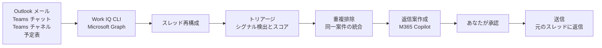

# Hey365

**English version: [README.md](README.md)**

Hey365 は、たったひとつの問いに答える Model Context Protocol (MCP) サーバーです。

> **「いま自分が返さないといけないものは、どれ？」**

MCP クライアントで **「Hey365」** と言うだけで、過去36時間の Outlook メール・Teams チャット・Teams チャネル・予定表を横断して調べ、**自分がまだ返していない／自分が対応すべき用件だけ**を抽出し、理由を説明して返信案まで作ります。送信は、あなたが明示的に指示したときだけ行われます。

```
Hey365 チェック完了

過去36時間で、あなたの対応が必要と思われるものが 2件あります。

🔴 1. 田中 太郎 / Teams Channel
00:48（1日前）

内容:
承知しました。調整頂けましたら会議リンクの送付をお願いいたします！

返信が必要な理由:
「調整頂けましたら会議リンクの送付をお願いいたします！」のように、依頼を受けています。

返信案:
ご連絡ありがとうございます。10/6（火）10:00-10:30 で確定しましたので、
本日中に会議リンクをお送りします。

------------------------------------------------

送信したいものがあれば、「1を送って」「全部送って」のように指示してください。
```

---

## なぜ作ったか

未読件数やメールの仕分けルールは、「参考までに共有します」と「あなたの承認待ちで止まっています」を区別してくれません。Hey365 は会話スレッドを再構成し、次の3つを順番に判定します。

1. **もう返したか？** 自分の最後のメッセージが相手の最後のメッセージより新しければ、その件は終わりです。キーワードではなく**時系列**で判定します。
2. **自分宛てか？** 自動通知、bot、CC のみ、純粋な FYI、スタンプだけの返信、すでに完了した会話は除外します。
3. **何を求められているか？** 承認依頼・判断待ち・直接の質問・日程調整・催促・作業依頼を**日本語と英語の両方**で検出し、重み付けしてスコア化します。

3つすべてを通過したものだけを、根拠となった一文とともに提示します。

## 仕組み



Microsoft 365 へのアクセスには [Work IQ CLI](https://www.npmjs.com/package/@microsoft/workiq)（認証済みの Microsoft Graph プロキシ）を使います。返信案は `workiq ask` 経由で Microsoft 365 Copilot が生成するため、**Hey365 独自の API キーは不要**です。

## 前提条件

| 項目 | 補足 |
|---|---|
| Node.js 20 以上 | `node --version` |
| Microsoft 365 の職場アカウント | Outlook と Teams |
| Microsoft 365 Copilot ライセンス | 返信案生成と会議要約に必要 |
| `@microsoft/workiq` | `hey365 setup` が自動でインストール・認証します |

## インストール

```bash
git clone https://github.com/monoqlo78/hey365.git
cd hey365
npm install
npm run build
```

続いて Microsoft 365 に接続します（Work IQ の導入、ブローカー認証の無効化、ブラウザでのサインインまで自動）。

```bash
node dist/index.js setup
node dist/index.js health     # "hey365": "ok" と表示されれば成功
```

## MCP クライアントへの登録

1コマンドで、既存の設定を壊さずに追記します。

```bash
node dist/index.js install copilot-cli        # GitHub Copilot CLI
node dist/index.js install vscode             # VS Code (GitHub Copilot)
node dist/index.js install claude-code        # Claude Code
node dist/index.js install claude-desktop     # Claude Desktop
node dist/index.js install codex              # OpenAI Codex CLI
node dist/index.js install cursor             # Cursor
node dist/index.js install windsurf           # Windsurf
node dist/index.js install scout              # Scout

node dist/index.js install --all              # 上記すべて
node dist/index.js install codex --dry-run    # 書き込まずに内容だけ確認
node dist/index.js install cursor --path ./.cursor/mcp.json
```

<details>
<summary>手動で設定する場合</summary>

多くのクライアント（`~/.copilot/mcp-config.json`、`~/.claude.json`、`~/.cursor/mcp.json` など）:

```json
{
  "mcpServers": {
    "hey365": {
      "command": "node",
      "args": ["/絶対パス/hey365/dist/index.js", "mcp"]
    }
  }
}
```

VS Code（`.vscode/mcp.json`）:

```json
{
  "servers": {
    "hey365": {
      "type": "stdio",
      "command": "node",
      "args": ["/絶対パス/hey365/dist/index.js", "mcp"]
    }
  }
}
```

Codex CLI（`~/.codex/config.toml`）:

```toml
[mcp_servers.hey365]
command = "node"
args = ["/絶対パス/hey365/dist/index.js", "mcp"]
```

</details>

## 使い方

話しかけるだけです。

| こう言う | こうなる |
|---|---|
| `Hey365` | 過去36時間をトリアージして返信案まで作成 |
| `Hey365 24時間` / `Hey365 last 12 hours` | 対象期間を変更 |
| `Hey365 3営業日分` | 直近3営業日（当日を含む）を対象にする |
| `9月18日を基準に3営業日` | 過去の日を基準にさかのぼる（休暇明けの確認に） |
| `Hey365 メールだけ` / `Teams だけ` | 対象ソースを限定 |
| `今日のまとめ` / `朝のダイジェスト` | 今日の会議・期限・放置中・未返信を1画面で |
| `田中さんの件どうなってる?` | Outlook と Teams を横断検索し、どちらが返す番かを表示 |
| `1をもう少し柔らかく` | 1番の返信案をやわらかい表現に書き直す |
| `3を英語で` | 3番の返信案を英語に書き直す |
| `1を送って` / `1と3を送って` / `全部送って` | その返信を送信する**（指示したときだけ）** |
| `1は明日でいい` | 翌営業日まで非表示にする |
| `1は対応済み` | 以後表示しない（新しい返信が来たら再表示） |
| `毎朝8時にダイジェストを出して` | OS のスケジューラに定期実行を登録（確認してから適用） |
| `Hey365 session <会議名>` | 会議・会話を要約（決定事項・Action Items・未解決） |

番号はクライアントを再起動しても保持されるので、朝トリアージして夕方に送る、といった使い方もできます。

### 休暇明けの使い方

```
9月18日を基準に3営業日分を見せて
```

`asOf` で基準日を、`businessDays` でさかのぼる営業日数を指定します。基準日自身を1日目として数え、土日祝は日数を消費しません。長期休暇のあとに「どこから読み直せばいいか」を決めるのに使えます。

### 放置アラート

3営業日（`HEY365_STALE_AFTER_DAYS` で変更可）を超えて返信していない用件には `⏰ N営業日おきっぱなしです。` が付き、重要度が自動で引き上げられ、一覧の先頭に並びます。

### ターミナルから使う

```bash
node dist/index.js triage --hours 36 --limit 10
node dist/index.js triage --business-days 3 --as-of 2026-09-18
node dist/index.js digest                      # 今日の会議・期限・未返信
node dist/index.js digest --out ~/hey365.txt   # ファイルに書き出す（定期実行向け）
node dist/index.js find "Fabric 移行"           # 人名・案件名で横断検索
node dist/index.js mutes                       # 非表示にしている項目の一覧
node dist/index.js schedule add --at 08:30     # 内容を表示するだけ
node dist/index.js schedule add --at 08:30 --apply
node dist/index.js session "Fabric 定例"
node dist/index.js health --deep
```

## ツール一覧

| ツール | 入力 | 役割 |
|---|---|---|
| `hey365` | `hours`, `businessDays`, `asOf`, `sources`, `limit`, `includeDrafts` | `hey365_triage` の別名。「Hey365」の入口 |
| `hey365_triage` | `hours`（既定36）, `businessDays`, `asOf`, `sources`（`outlook`/`teams`/`meetings`）, `limit`, `includeDrafts` | 収集・トリアージ・返信案作成 |
| `hey365_digest` | `asOf`, `businessDays`, `limit` | 今日の会議・期限切れ・放置中・未返信を1画面にまとめる |
| `hey365_find` | `keyword`, `days`, `sources`, `limit` | 人名や案件名で Outlook と Teams を横断検索。どちらが返す番かを表示 |
| `hey365_session` | `sessionId`, `includeDraft` | 会議やスレッドを要約（決定事項・Action Items・未解決） |
| `hey365_draft` | `itemId`, `instruction` | 返信案の書き直し（柔らかく／短く／英語で） |
| `hey365_send` | `itemIds`, `confirm` | 承認された返信を元のスレッドに送信 |
| `hey365_snooze` | `itemIds`, `action`（`snooze`/`done`/`unmute`）, `businessDays`, `note` | 一定期間隠す／対応済みにする／再表示する |
| `hey365_mutes` | – | いま隠している項目の一覧 |
| `hey365_schedule` | `action`（`list`/`add`/`remove`）, `job`, `at`, `weekdaysOnly`, `apply` | ダイジェストの定期実行を登録・解除・一覧 |
| `hey365_health` | `deep` | 接続・認証・読み書き権限の状態 |
| `hey365_setup` | `interactive` | Work IQ の導入と認証 |
| `hey365_install` | `clients`, `dryRun` | 他の MCP クライアントへ Hey365 を登録 |

## 安全設計

- **送信は完全に別ステップ。** トリアージと返信案作成では一切送信しません。
- **見たものだけが送られる。** 返信案にはハッシュを付与し、`hey365_send` はあなたが見ていない文面の送信を拒否します。
- **スレッドから出ない。** 送信は `reply` を使うため、新規スレッドの作成や宛先の追加は行いません。
- **事実を創作しない。** 回答に必要な情報が会話中に無い場合、返信案はその旨を明示し、あなたの判断を求めます。
- **「対応済み」は取り消せる。** `done` にした会話でも、より新しいメッセージが届けば自動で再表示されます。読んだ分についての宣言でしかないためです。
- **OS を勝手に変更しない。** `hey365_schedule` は既定では登録するコマンドを表示するだけで、`apply=true` を指定したときだけ実際に登録します。
- **外部送信なし。** Microsoft Graph 以外の第三者 API もテレメトリもありません。ログは stderr のみでトークンは秘匿され、ローカル状態（`~/.hey365/state.json`）は `0600` で保存されます。

## 環境変数

| 変数 | 既定値 | 用途 |
|---|---|---|
| `HEY365_TIMEZONE` | `Asia/Tokyo` | 表示タイムゾーン |
| `HEY365_VIP` | – | 重要送信者のアドレス（カンマ区切り）。重要度を加点 |
| `HEY365_MY_NAMES` | – | 自分の名前の別表記（例: `曽我部,Sogabe`）。本文で名指しされたかの判定に使用 |
| `HEY365_BUSINESS_DAYS` | `on` | `off` にすると営業日換算をやめ、単純な実時間で遡る |
| `HEY365_STALE_AFTER_DAYS` | `3` | 何営業日放置されたら「放置中」として警告するか |
| `HEY365_HOLIDAY_CALENDAR` | 自動 | `jp` で日本の祝日カレンダーを強制、`none` で無効化。タイムゾーンが `Asia/Tokyo` なら既定で `jp` |
| `HEY365_HOLIDAYS` | – | 追加の非稼働日を `YYYY-MM-DD` のカンマ区切りで指定（全社休業日・自分の休暇など） |
| `HEY365_WORKIQ_COMMAND` | 自動 | Work IQ CLI の起動方法を上書き |
| `HEY365_WORKIQ_ACCOUNT` | – | 複数アカウント時に使用するアカウント |
| `HEY365_WORKIQ_TIMEOUT_MS` | `120000` | 1回あたりのタイムアウト |
| `HEY365_LOG_LEVEL` | `info` | `silent`/`error`/`warn`/`info`/`debug` |
| `HEY365_STATE_FILE` | `~/.hey365/state.json` | 返信案の保存先 |

## トラブルシューティング

まず `node dist/index.js health` を実行してください。失敗は必ずコード化され、次の一手が示されます。

| コード | 対処 |
|---|---|
| `WORKIQ_NOT_INSTALLED` | `node dist/index.js setup`、または `npm i -g @microsoft/workiq` |
| `WORKIQ_NOT_AUTHENTICATED` / `WORKIQ_AUTH_EXPIRED` | `node dist/index.js setup` でブラウザからサインイン |
| `WORKIQ_EULA_REQUIRED` | `npx @microsoft/workiq accept-eula` |
| `WORKIQ_ADMIN_CONSENT_REQUIRED` | テナント管理者に `npx @microsoft/workiq auth consent` を依頼 |
| `WORKIQ_CONNECTION_ERROR` | ネットワークを確認して再実行 |
| `WORKIQ_PERMISSION_DENIED` | 一部ソースが読めません。取得できた範囲で継続します |
| `WORKIQ_WRITE_DISABLED` | トリアージと返信案は利用可。送信はポリシーで不可 |
| `SESSION_NOT_FOUND` | 件名のキーワードや日付を変えて `hey365_session` を再実行 |
| `DRAFT_MISMATCH` | 返信案が更新されています。内容を確認して送り直してください |

Windows では、ブローカー認証（WAM）でサインインに失敗することがあります。`setup` が自動的に無効化（`workiq config set disableBrokeredAuth=true`）し、ブラウザ認証にフォールバックします。

## 開発

```bash
npm run typecheck     # tsc --noEmit
npm test              # vitest
npm run build         # tsc
npm run smoke         # ビルド済みサーバーへの MCP ハンドシェイク確認
```

## ライセンス

[MIT](LICENSE)
