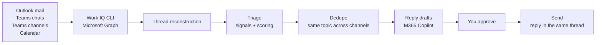

# Hey365

**日本語版は [README.ja.md](README.ja.md) をご覧ください。**

Hey365 is a Model Context Protocol (MCP) server that answers one question:

> **"What do I actually owe people right now?"**

Say **"Hey365"** in any MCP client and it scans the last 36 hours of your Outlook mail, Teams chats, Teams channels and calendar, works out which conversations are *still waiting on you*, explains why, and drafts the replies. Nothing is ever sent unless you explicitly say so.

```
Hey365 チェック完了

過去36時間で、あなたの対応が必要と思われるものが 2件あります。

🔴 1. Yohsai Hirano / Teams Channel
00:48（1日前）

内容:
承知しました。調整頂けましたら会議リンクの送付をお願いいたします！

返信が必要な理由:
「調整頂けましたら会議リンクの送付をお願いいたします！」のように、依頼を受けています。

返信案:
ご連絡ありがとうございます。10/6（火）10:00-10:30 で確定しましたので、
本日中に会議リンクをお送りします。

------------------------------------------------

送信したいものがあれば、「1を送って」「全部送って」のように指示してください。
```

---

## Why it exists

Inbox rules and unread counts do not know the difference between "FYI, sharing this" and "I am blocked waiting for your approval". Hey365 answers that by reconstructing every conversation thread and asking three questions in order:

1. **Did I already answer?** If my last message is newer than their last message, the thread is done. No keyword matching — pure thread chronology.
2. **Is this for me?** Automated notifications, bots, mails where I am only on CC, pure FYI broadcasts, reaction-only replies and closed conversations are dropped.
3. **What is being asked?** Approval requests, decisions, direct questions, scheduling, follow-up nudges and assigned actions are detected in both Japanese and English, then weighted and scored.

What survives all three is shown to you, newest signal first, with the exact sentence that triggered it.

## How it works



Hey365 talks to Microsoft 365 through the [Work IQ CLI](https://www.npmjs.com/package/@microsoft/workiq), which is an authenticated Microsoft Graph proxy. Reply drafts are written by Microsoft 365 Copilot via `workiq ask`, so **Hey365 needs no API keys of its own**.

## Requirements

| Requirement | Notes |
|---|---|
| Node.js 20+ | `node --version` |
| A Microsoft 365 work account | Outlook + Teams |
| Microsoft 365 Copilot license | Required for reply drafting and session summaries |
| `@microsoft/workiq` | Installed and authenticated automatically by `hey365 setup` |

## Install

```bash
git clone https://github.com/monoqlo78/hey365.git
cd hey365
npm install
npm run build
```

Then connect Microsoft 365 (installs Work IQ if missing, disables broker auth, opens a browser sign-in):

```bash
node dist/index.js setup
node dist/index.js health     # should print "hey365": "ok"
```

## Register with your MCP client

One command writes the correct config for you, merging into any existing file:

```bash
node dist/index.js install copilot-cli        # GitHub Copilot CLI
node dist/index.js install vscode             # VS Code (GitHub Copilot)
node dist/index.js install claude-code        # Claude Code
node dist/index.js install claude-desktop     # Claude Desktop
node dist/index.js install codex              # OpenAI Codex CLI
node dist/index.js install cursor             # Cursor
node dist/index.js install windsurf           # Windsurf
node dist/index.js install scout              # Scout

node dist/index.js install --all              # every client above
node dist/index.js install codex --dry-run    # preview without writing
node dist/index.js install cursor --path ./.cursor/mcp.json
```

<details>
<summary>Manual configuration</summary>

Most clients (`~/.copilot/mcp-config.json`, `~/.claude.json`, `~/.cursor/mcp.json`, …):

```json
{
  "mcpServers": {
    "hey365": {
      "command": "node",
      "args": ["/absolute/path/to/hey365/dist/index.js", "mcp"]
    }
  }
}
```

VS Code (`.vscode/mcp.json`):

```json
{
  "servers": {
    "hey365": {
      "type": "stdio",
      "command": "node",
      "args": ["/absolute/path/to/hey365/dist/index.js", "mcp"]
    }
  }
}
```

Codex CLI (`~/.codex/config.toml`):

```toml
[mcp_servers.hey365]
command = "node"
args = ["/absolute/path/to/hey365/dist/index.js", "mcp"]
```

</details>

## Usage

Just talk to your assistant.

| You say | What happens |
|---|---|
| `Hey365` | Triage the last 36 hours and draft replies |
| `Hey365 24時間` / `Hey365 last 12 hours` | Change the window |
| `Hey365 メールだけ` / `Teams only` | Limit the sources |
| `1をもう少し柔らかく` | Rewrite draft #1 in a softer tone |
| `3を英語で` | Rewrite draft #3 in English |
| `1を送って` / `1と3を送って` / `全部送って` | Send those replies **(only when you say so)** |
| `Hey365 session <会議名>` | Summarise a meeting or conversation with decisions, action items and open questions |

The numbering survives client restarts, so you can triage now and send later.

### From the terminal

```bash
node dist/index.js triage --hours 36 --limit 10
node dist/index.js triage --no-drafts
node dist/index.js session "Fabric 定例"
node dist/index.js health --deep
```

## Tools

| Tool | Input | Purpose |
|---|---|---|
| `hey365` | `hours`, `sources`, `limit`, `includeDrafts` | Alias of `hey365_triage`, the entry point for "Hey365" |
| `hey365_triage` | `hours` (default 36), `sources` (`outlook`/`teams`/`meetings`), `limit`, `includeDrafts` | Scan, triage and draft |
| `hey365_session` | `sessionId`, `includeDraft` | Summarise one meeting/thread: decisions, action items, open questions |
| `hey365_draft` | `itemId`, `instruction` | Rewrite a draft ("softer", "shorter", "in English") |
| `hey365_send` | `itemIds`, `confirm` | Send approved replies into the original thread |
| `hey365_health` | `deep` | Connection, authentication, read/write status |
| `hey365_setup` | `interactive` | Install + authenticate Work IQ |
| `hey365_install` | `clients`, `dryRun` | Register Hey365 with other MCP clients |

## Safety

- **Send is a separate, explicit step.** Triage and drafting never send anything.
- **What you saw is what is sent.** Each draft carries a hash; `hey365_send` refuses to send text you have not seen.
- **Replies stay in the thread.** Sending uses `reply`, so Hey365 never starts a new conversation or adds new recipients.
- **Drafts never invent facts.** If the thread lacks the information needed to answer, the draft says so and asks you to decide.
- **Nothing leaves your machine except through Microsoft Graph.** No third-party API, no telemetry. Logs go to stderr with tokens redacted, and local state (`~/.hey365/state.json`) is written with `0600`.

## Environment variables

| Variable | Default | Purpose |
|---|---|---|
| `HEY365_TIMEZONE` | `Asia/Tokyo` | Display timezone |
| `HEY365_VIP` | – | Comma-separated addresses that get an importance boost |
| `HEY365_WORKIQ_COMMAND` | auto | Override how the Work IQ CLI is launched |
| `HEY365_WORKIQ_ACCOUNT` | – | Account to use when several are signed in |
| `HEY365_WORKIQ_TIMEOUT_MS` | `120000` | Per-call timeout |
| `HEY365_LOG_LEVEL` | `info` | `silent`/`error`/`warn`/`info`/`debug` |
| `HEY365_STATE_FILE` | `~/.hey365/state.json` | Where drafts are persisted |

## Troubleshooting

Run `node dist/index.js health` first. Every failure maps to a code with a concrete next step:

| Code | Fix |
|---|---|
| `WORKIQ_NOT_INSTALLED` | `node dist/index.js setup`, or `npm i -g @microsoft/workiq` |
| `WORKIQ_NOT_AUTHENTICATED` / `WORKIQ_AUTH_EXPIRED` | `node dist/index.js setup` and sign in through the browser |
| `WORKIQ_EULA_REQUIRED` | `npx @microsoft/workiq accept-eula` |
| `WORKIQ_ADMIN_CONSENT_REQUIRED` | Ask a tenant admin to run `npx @microsoft/workiq auth consent` |
| `WORKIQ_CONNECTION_ERROR` | Check the network, then retry |
| `WORKIQ_PERMISSION_DENIED` | Some sources are not readable; Hey365 continues with the rest |
| `WORKIQ_WRITE_DISABLED` | Triage and drafts work, sending is blocked by policy |
| `SESSION_NOT_FOUND` | Re-run `hey365_session` with a subject keyword or date |
| `DRAFT_MISMATCH` | The draft changed after you saw it — review and send again |

On Windows, sign-in can fail inside the broker (WAM). `setup` disables it automatically (`workiq config set disableBrokeredAuth=true`) and falls back to browser authentication.

## Development

```bash
npm run typecheck     # tsc --noEmit
npm test              # vitest
npm run build         # tsc
npm run smoke         # MCP handshake against the built server
```

## License

[MIT](LICENSE)
